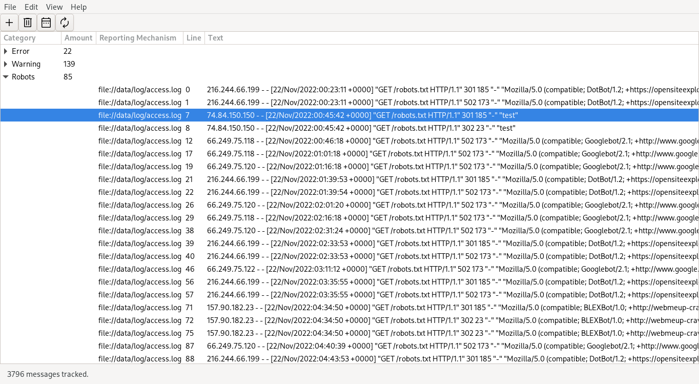

## Overview

This is a simple log viewing utility. I made it to handle logging infrastructure
spread over multiple files and from multiple sources like database or network
logs.

## Screenshots
<p align="center">
  
</p>

## Features

- View the output of distributed logging infrastructure
- Filter messages by time, regex, or pattern matching
- GTK+ 3.0 interface
- Add or remove filters at runtime
- Save filters in JSON format
- Filters can be toggled between case sensitive and insensitive
- Cross-platform (tested on Linux and Windows)
- Histogram to determine common tokens in the input material
- Random sampling of lines to help develop better filters
- Regex compilation to aid performance
- Both filename and line number are reported when presenting matches
- UI defined as XML for easy development
- CSS styling for easy theme editing

## Dependencies

```
g++
libboost-all-dev
libgtk-3-dev
make
pkg-config
```

## License

This work is licensed under the GNU General Public License version 3 (GPLv3).

[](https://www.gnu.org/licenses/gpl-3.0.en.html)
